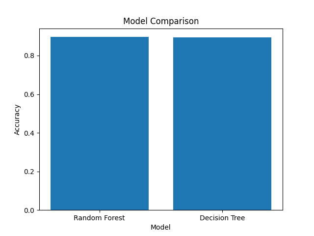

# Machine Learning for Cyber Threat Detection

## Overview
This project explores the application of machine learning techniques for detecting cybersecurity threats in network traffic data. The goal is to classify connections as normal or malicious using real-world datasets.

## Objectives
- Apply machine learning algorithms to cybersecurity data
- Compare model performance for threat detection
- Evaluate classification results using standard metrics

## Technologies Used
- Python
- Pandas
- Scikit-learn
- Matplotlib

## Dataset
This project uses the **NSL-KDD dataset**, a widely used benchmark for intrusion detection research.

## Methodology
- Data preprocessing and feature encoding using one-hot encoding
- Splitting data into training and testing sets
- Training machine learning models:
  - Random Forest
  - Decision Tree
- Evaluating performance using:
  - Accuracy
  - Precision
  - Recall
  - F1-score

## Results
The Random Forest model slightly outperformed the Decision Tree, showing better generalization performance for detecting cyber threats.

## Model Comparison



## Project Structure


Cyber_Threat_Detection_com_Machine_Learning/
│
├── data/
│   └── KDDTrain+.txt
├── main.py
├── README.md


## How to Run

1. Clone the repository:
```bash
git clone https://github.com/SEU-USUARIO/NOME-DO-REPO.git

cd Cyber_Threat_Detection_com_Machine_Learning

python -m pip install pandas scikit-learn matplotlib

python main.py

